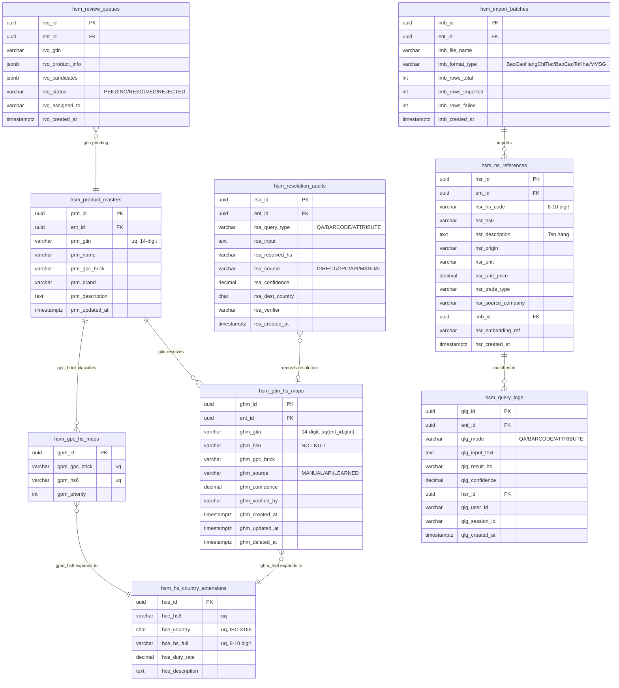

# HS Code Manager — ERD (HS코드 매니저 ERD)

Conforms to `amoeba_code_convention_v2.md`: DB `db_hsm`, tables `hsm_{plural}`, columns `{colPrefix}_{name}`, UUID PK `{colPrefix}_id`, `ent_id` FK for multi-tenancy, PostgreSQL 15. Core of the model is the 3-table strategy from `GTIN_HSCode_설계문서.md`. SQL DDL: `sql/hscode-manager-schema.sql`.

Naming map (v1 → v2): `gtin_hs_map`→`hsm_gtin_hs_maps`(ghm), `gpc_hs_map`→`hsm_gpc_hs_maps`(gpm), `hs_country_ext`→`hsm_hs_country_extensions`(hce), `product_master`→`hsm_product_masters`(prm), `import_batch`→`hsm_import_batches`(imb), `hs_reference`→`hsm_hs_references`(hsr), `query_log`→`hsm_query_logs`(qlg), `review_queue`→`hsm_review_queues`(rvq), `resolution_audit`→`hsm_resolution_audits`(rsa).

> `hsm_gpc_hs_maps` and `hsm_hs_country_extensions` are global reference data (no `ent_id`). All operational tables carry `ent_id` for tenant isolation.

## ER Diagram

## Table Definitions (주요 테이블 정의)

### hsm_gtin_hs_maps — Layer 1 direct mapping (최우선 조회)
| Column | Type | NULL | Note |
|--------|------|------|------|
| ghm_id | UUID | NO | PK (gen_random_uuid) |
| ent_id | UUID | NO | multi-tenancy FK |
| ghm_gtin | VARCHAR(14) | NO | uq(ent_id, ghm_gtin) |
| ghm_hs6 | VARCHAR(6) | NO | HS6 |
| ghm_gpc_brick | VARCHAR(8) | YES | GPC Brick |
| ghm_source | VARCHAR(20) | NO | MANUAL/API/LEARNED (FR-018) |
| ghm_confidence | DECIMAL(4,3) | YES | |
| ghm_verified_by | VARCHAR(64) | YES | |
| ghm_created_at / ghm_updated_at / ghm_deleted_at | TIMESTAMPTZ | NO/NO/YES | soft delete |

### hsm_gpc_hs_maps — Layer 3 GPC→HS (1:many, global ref)
PK `gpm_id`; uq(`gpm_gpc_brick`,`gpm_hs6`); `gpm_priority` for candidate ordering.

### hsm_hs_country_extensions — country expansion (global ref)
PK `hce_id`; uq(`hce_hs6`,`hce_country`,`hce_hs_full`); `hce_duty_rate`, `hce_description`.

### hsm_hs_references — corpus reference (Q&A / attribute base)
Seeded from the 면장리스트 corpus (~94.7k rows); `hsr_embedding_ref` links to the vector index; FK `imb_id` → `hsm_import_batches`.

### hsm_product_masters / hsm_query_logs / hsm_review_queues / hsm_resolution_audits / hsm_import_batches
Support product-info caching (FN-012), search logging (FR-005), low-confidence review (FR-019), audit trail (FR-020), and import tracking (FR-040). Full columns in the Mermaid block and the DDL file.

## Constraint Naming (제약 네이밍, per convention §4.4)
- PK: `pk_{table}` (e.g. `pk_hsm_gtin_hs_maps`)
- FK: `fk_{table}_{ref_table}` (e.g. `fk_hsm_hs_references_hsm_import_batches`)
- Unique: `uq_{table}_{column}` (e.g. `uq_hsm_gtin_hs_maps_gtin`)
- Index: `idx_{table}_{column(s)}` (e.g. `idx_hsm_hs_references_hs6`)

## Migration Notes (마이그레이션 노트)
- `hsm_gpc_hs_maps` is internally maintained until the GS1-WCO official GPC-HS dataset is commercialized (design doc §8) — then replace as reference data.
- `hsm_hs_country_extensions` is additive: new destination countries are added without rebuilding mapping tables.
- `hsm_hs_references` is the only large table (corpus scale); index `hsr_hs6`, `hsr_hs_code`, `hsr_source_company`, `ent_id`; embeddings stored externally (pgvector/managed) and referenced by `hsr_embedding_ref`.
- Per convention §16, prepare manual SQL migration for staging/production (no auto-sync).
- Initial seed: run import adapters (FN-040) over the 면장리스트 files, then embed (FN-041).
