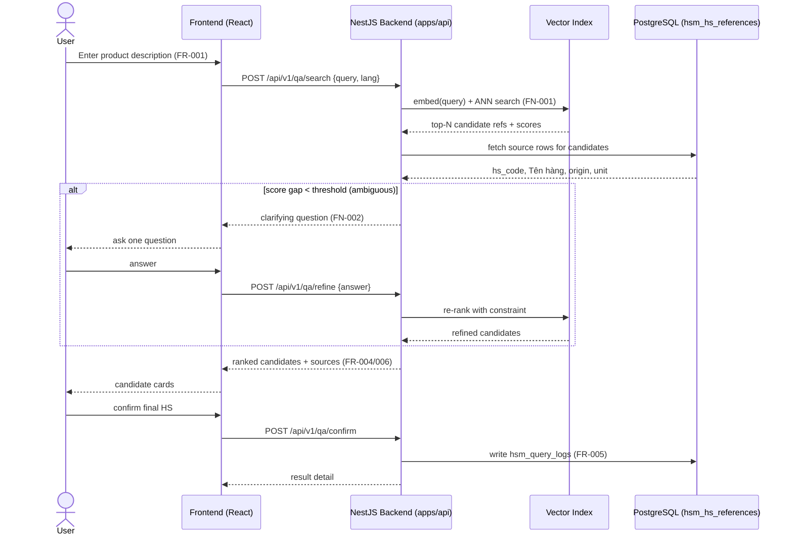
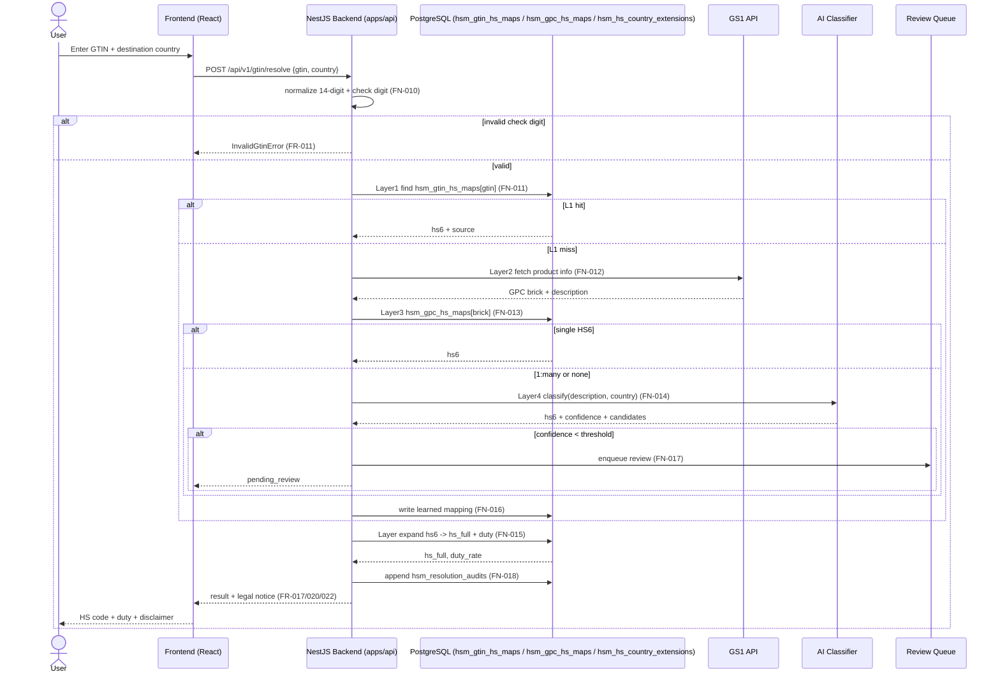
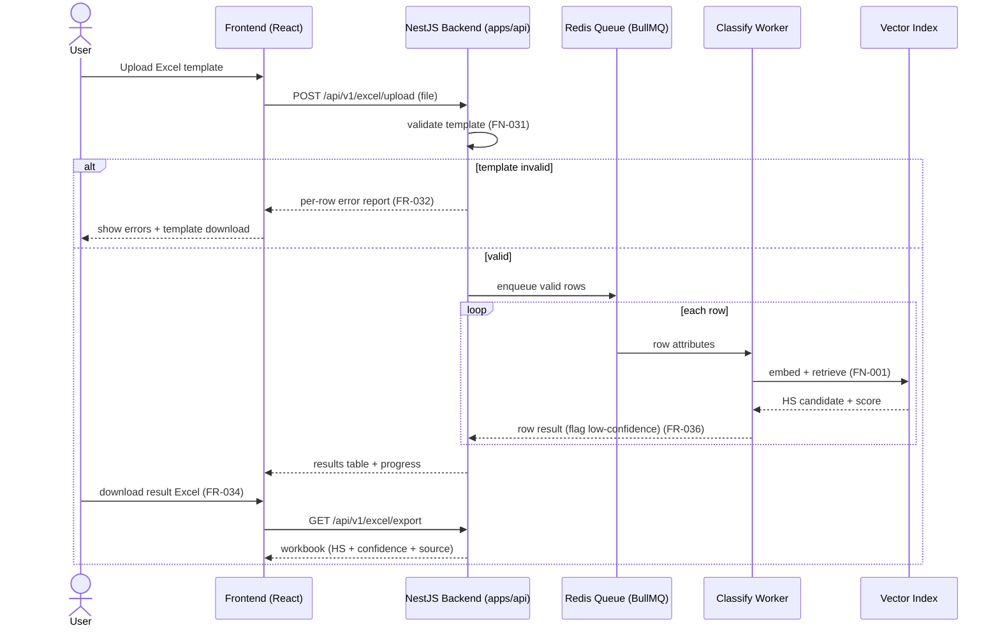
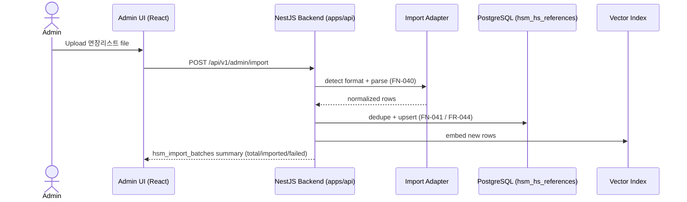

# HS Code Manager — Sequence Diagrams (HS코드 매니저 시퀀스 다이어그램)

Participants use the actual AmoebaTalk stack: React frontend, NestJS backend, PostgreSQL, Redis Queue (BullMQ), plus external GS1 / AI classifier. (실제 기술스택 컴포넌트명을 participant로 사용한다.)

---

## Scenario 1: Conversational Q&A Search (질문응답형 검색) — FN-001/002/003

---

## Scenario 2: Barcode (GTIN) 4-Layer Resolution (바코드 4계층 조회) — FN-010~018

---

## Scenario 3: Attribute / Excel Batch Search (속성/엑셀 일괄 조회) — FN-031/032

---

## Scenario 4: Reference Import (참조 데이터 import) — FN-040/041

