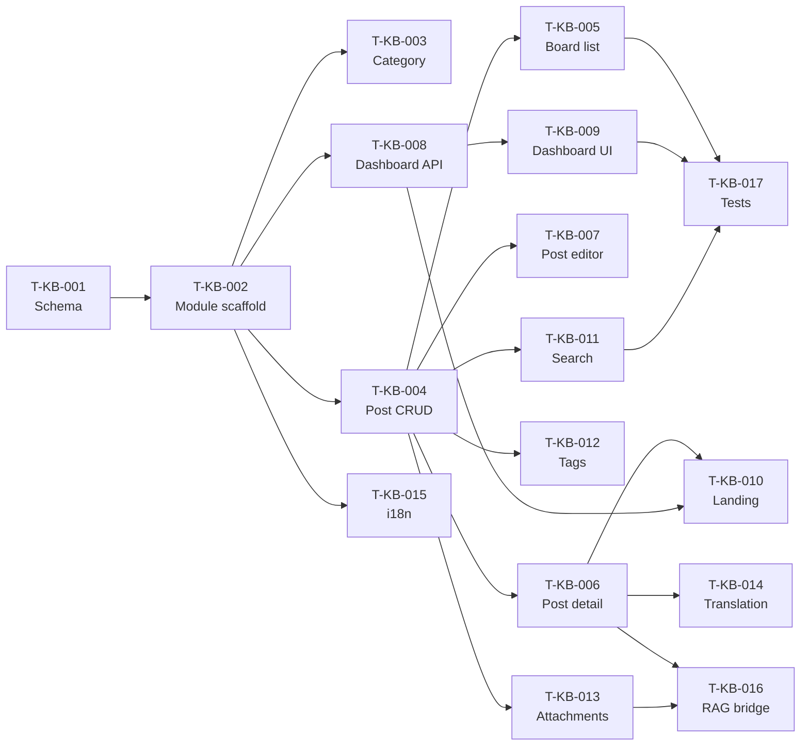

# Cargorush Knowledge Base — Development Plan & WBS (카고러쉬 지식창고 개발계획서·작업계획서)

Development plan and Work Breakdown Structure for the **[Knowledge Base] (지식창고)** menu, derived from
`knowledge-base-requirements.md` (FR-KB-001~015). Each WBS task maps to a GitHub Issue and is tracked on
the GitHub Project board.

---

## 1. Overview (개요)

- **Project**: Knowledge Base menu for the Cargorush HS Code Agent (카고러쉬 HS 에이전트 지식창고)
- **Scope**: Board-type reference library (national HS tables, HS common knowledge, clearance basics) +
  admin-editable dashboard (notice / key tips), integrated search, 50MB attachments, single-author
  on-demand translation (ko/en/vi/id), and RAG-corpus promotion bridge.
- **Reference docs**: `knowledge-base-requirements.md` Part A/B/E.
- **Convention**: Amoeba Code Convention v2 — Project code **CGR**, DB **`db_cgr`**, prefix **`cgr_kb_`**.
- **GitHub Project**: {project-board-url — to be created}

## 2. Technical Architecture (기술 아키텍처)

Per Convention v2 §1.2 (overrides the AmoebaTalk default stack).

| Layer | Technology |
|---|---|
| Frontend | React 18 + TypeScript + TailwindCSS; Zustand + React Query (entityId in QueryKey, §6.1) |
| Backend | NestJS 10 + TypeScript; Clean Architecture + DDD |
| Database | PostgreSQL 15 (`db_cgr`) |
| Auth | `@Auth()` (JWT + OwnEntityGuard) default; `@AdminOnly()` for edit APIs (§5.7) |
| Translation | Anthropic Claude API (@anthropic-ai/sdk, §1.2) |
| Object storage | Attachment binaries (DB stores path only) |

New module path (§3.1): `apps/api/src/domains/knowledge-base/`.
Frontend module: domain-based, per-domain store, API calls only in the service layer (§6.1).

## 3. Development Environment (개발 환경)

- **Branch strategy** (§15): branch `feature/{gh-num}-{desc}` from `main`; PR → `main` (Squash Merge,
  1 approval); `main` → `production` (Merge Commit). Hotfix from `production`.
- **Commit convention** (§15.3): `{type}: {description}` — feat | fix | docs | refactor | test | chore.
- **Manual SQL migration** prepared for staging/production (§16 backend checklist).
- Dev / Staging (`main`) / Production (`production`) environments.

## 4. Schedule Summary (개발 일정)

Estimates are working-day rough orders (팀 규모 확정 시 재산정). Sequencing follows Requirements Part D.

| Phase | Duration | Deliverable | Milestone |
|---|---|---|---|
| Environment & schema | ~3d | `cgr_kb_*` migration, module scaffold | |
| Core board (P0) | ~8d | Category/post CRUD, list/detail (SCR-KB-02/03/04) | **M1: Board MVP** |
| Admin dashboard (P0) | ~5d | Notice + tips inline/drag editing (SCR-KB-01) | **M2: Admin dashboard** |
| Search + attachments (P0) | ~6d | Integrated search/filters, 50MB upload/download | **M3: Searchable + files** |
| Translation (P1) | ~5d | On-demand translation box + cache (ko/en/vi/id) | |
| RAG bridge + QA (P1) | ~5d | Post→RAG promotion, stabilization, test reports | **M4: Release** |

## 5. Risk Management (리스크 관리)

| Risk | Impact | Mitigation |
|---|---|---|
| Multilingual search tokenization (ko/en/vi/id) underperforms | Search recall drops for vi/id | Validate PostgreSQL FTS config per language early (T-004); fall back to trigram/`pg_trgm` if needed |
| Translation cost/latency on-demand | Reader-facing latency | Cache by (`pst_id`, target_lang); `ptr_source=MANUAL` never overwritten (NFR-KB-003) |
| RAG promotion couples two domains | Hidden cross-domain dependency | Bridge via Service/API only, never direct Repository import (§2.2); promotion is one-way |
| 50MB uploads strain API | Timeouts / memory | Stream to object storage; enforce size pre-check; DB holds path only |
| Indonesian (id) not in Convention v2 standard | Doc-management drift | Track as project-local extension until standardization decision (Part C open item) |

## 6. Communication Plan (커뮤니케이션)

- KR–VN distributed team; PR review required (1 approval) per branch.
- WBS tasks tracked as GitHub Issues on the Project board (Backlog → In Development → In Review →
  Testing → Done).
- Design-doc changes version-controlled (docs branch → PR to `main`).

---

# WBS (Work Breakdown Structure)

## Task List (태스크 목록)

| ID | Task | Depends On | Effort | Priority | GitHub Issue | Branch | Status |
|---|---|---|---|---|---|---|---|
| T-KB-001 | Schema + migration: `cgr_kb_*` tables, indexes, constraints (§4.4) | - | 2d | P0 | #{n} | feature/{n}-kb-schema | Backlog |
| T-KB-002 | NestJS module scaffold `knowledge-base/` (entities, DTOs, `@Auth()`/`@AdminOnly()`) | T-KB-001 | 2d | P0 | #{n} | feature/{n}-kb-module-scaffold | Backlog |
| T-KB-003 | Category CRUD API + management screen (SCR-KB-05, FR-KB-015) | T-KB-002 | 2d | P0 | #{n} | feature/{n}-kb-category | Backlog |
| T-KB-004 | Post CRUD API (single-author, `pst_source_lang`; soft delete) (FR-KB-003/008) | T-KB-002 | 3d | P0 | #{n} | feature/{n}-kb-post-crud | Backlog |
| T-KB-005 | Board list screen + pagination + category filter (SCR-KB-02, FR-KB-001) | T-KB-004 | 2d | P0 | #{n} | feature/{n}-kb-board-list | Backlog |
| T-KB-006 | Post detail screen + related posts + pin/view-count (SCR-KB-03, FR-KB-002/010) | T-KB-004 | 2d | P0 | #{n} | feature/{n}-kb-post-detail | Backlog |
| T-KB-007 | Post create/edit screen (SCR-KB-04, FR-KB-003) | T-KB-004 | 2d | P0 | #{n} | feature/{n}-kb-post-editor | Backlog |
| T-KB-008 | Dashboard blocks API (`cgr_kb_dashboard_blocks`, NOTICE/TIP, sort_order) (FR-KB-005/006) | T-KB-002 | 2d | P0 | #{n} | feature/{n}-kb-dashboard-api | Backlog |
| T-KB-009 | Dashboard screen: notice inline edit + tips drag-reorder (SCR-KB-01) | T-KB-008 | 3d | P0 | #{n} | feature/{n}-kb-dashboard-ui | Backlog |
| T-KB-010 | Dashboard landing: category shortcuts + latest + popular (FR-KB-007) | T-KB-006, T-KB-008 | 2d | P0 | #{n} | feature/{n}-kb-dashboard-landing | Backlog |
| T-KB-011 | Integrated search API (title/body/HS/tags) + filters (FR-KB-004, NFR-KB-002) | T-KB-004 | 3d | P0 | #{n} | feature/{n}-kb-search | Backlog |
| T-KB-012 | Tag management + post-tag mapping (FR-KB-013) | T-KB-004 | 2d | P1 | #{n} | feature/{n}-kb-tags | Backlog |
| T-KB-013 | Attachment upload/download, 50MB + format whitelist, object storage (FR-KB-011/012, NFR-KB-004) | T-KB-004 | 3d | P0 | #{n} | feature/{n}-kb-attachments | Backlog |
| T-KB-014 | On-demand translation box + `cgr_kb_post_translations` cache (Claude API) (FR-KB-009, NFR-KB-003) | T-KB-006 | 3d | P1 | #{n} | feature/{n}-kb-translation | Backlog |
| T-KB-015 | i18n setup ko/en/vi/id + all UI text externalized (§6.1, §14 + id) | T-KB-002 | 2d | P1 | #{n} | feature/{n}-kb-i18n | Backlog |
| T-KB-016 | RAG promotion bridge: promote post → `cgr_hs_documents` via Service/API (FR-KB-014) | T-KB-006, T-KB-013 | 2d | P1 | #{n} | feature/{n}-kb-rag-promote | Backlog |
| T-KB-017 | Unit tests (TC-KB-*) + integration test (ITC-KB-*) + stabilization | T-KB-* | 3d | P0 | #{n} | feature/{n}-kb-tests | Backlog |

**Total rough effort**: ~40 working days (team-size dependent; parallelizable across FE/BE).

## Milestones (마일스톤)

| Milestone | Completion Criteria | GitHub Milestone |
|---|---|---|
| M1: Board MVP | T-KB-001~007 done (schema, category/post CRUD, list/detail/editor) | {milestone-url} |
| M2: Admin dashboard | T-KB-008~010 done (notice inline + tips drag + landing) | {milestone-url} |
| M3: Searchable + files | T-KB-011, T-KB-013 done (search/filters, 50MB attachments) | {milestone-url} |
| M4: Release | T-KB-012/014/015/016 done + T-KB-017 QA passed | {milestone-url} |

## GitHub Project Board

- **Columns**: Backlog → In Development → In Review → Testing → Done
- **Labels**: `task`, `stage:implementation`, `knowledge-base`, `priority:{P0|P1|P2}`
- Each task → GitHub Issue (WBS template) → branch → PR ("Closes #{n}") → review → merge → close.

---

## Dependency Graph (의존 관계)



---

## Sample GitHub Issue Body (T-KB-009 example)

```markdown
---
title: "[T-KB-009] Dashboard screen: notice inline edit + tips drag-reorder"
labels: ["task", "stage:implementation", "knowledge-base", "priority:P0"]
milestone: "M2: Admin dashboard"
project: "Knowledge Base Development"
---

## Task Information
- **Task ID**: T-KB-009
- **Feature**: knowledge-base
- **Priority**: P0
- **Estimated effort**: 3 days
- **Depends on**: #{issue of T-KB-008}

## Description (설명)
Implement SCR-KB-01 admin editing: Notice block inline add/delete, Key-tips block add/delete and
drag-reorder persisting `dsb_sort_order`. Edit controls visible only under `@AdminOnly()` (ADMIN_LEVEL).

## Acceptance Criteria (완료 조건)
- [ ] Notice inline add/delete works and persists (FR-KB-005)
- [ ] Tip cards drag-reorder persists dsb_sort_order (FR-KB-006)
- [ ] Edit UI hidden for USER_LEVEL, shown for ADMIN_LEVEL
- [ ] All UI text via i18n (ko/en/vi/id)
- [ ] Unit tests pass (TC-KB-009); code review approved

## References (참조 문서)
- Requirements: knowledge-base-requirements.md → FR-KB-005/006, SCR-KB-01
- API: /api/v1/knowledge-base/dashboard-blocks
```
