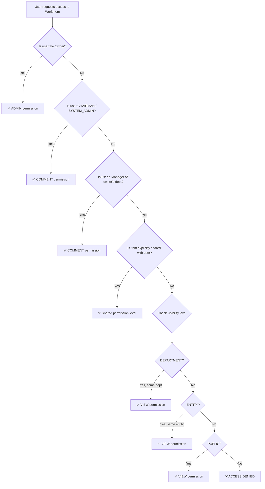

# AMB Platform Access Control Policy — Owner-based Visibility & Sharing
# (AMB 플랫폼 접근제어 정책 — 소유자 기반 가시성 및 공유)

## 1. Overview (개요)

This document defines the **platform-level access control policy** for amoebaManagement (AMB). While individual modules (Billing, Payroll) maintain their own functional RBAC policies, this policy governs the **cross-cutting visibility and sharing model** for all user-generated work items across the AMB platform.

본 문서는 amoebaManagement(AMB) 전체에 적용되는 **플랫폼 레벨 접근제어 정책**을 정의한다. Billing, Payroll 등 개별 모듈의 기능별 RBAC 정책과 별개로, 사용자가 생성한 모든 작업물에 대한 **가시성(visibility)과 공유(sharing) 모델**을 규정한다.

### 1.1 Core Principles (핵심 원칙)

| # | Principle | Description |
|---|-----------|-------------|
| P1 | **Owner-first** (소유자 우선) | All work items are visible only to their creator by default |
| P2 | **Explicit Sharing** (명시적 공유) | Others can view only when the owner explicitly shares |
| P3 | **Hierarchical Visibility** (계층적 가시성) | Department managers can view all work within their department |
| P4 | **Comment & Feedback** (코멘트 및 피드백) | Authorized viewers (managers) can add comments to work items |
| P5 | **AI Native** (AI 네이티브) | AI agents operate under the same access control rules as human users |

### 1.2 Scope (적용 범위)

| In Scope | Out of Scope |
|----------|-------------|
| KMS documents, daily reports, ToDo items | Billing module data (governed by BILLING-POL) |
| Task/work outputs across all modules | Payroll data (governed by PAYROLL-POL) |
| Uploaded files and analysis results | System configuration and admin settings |
| AI-generated analysis and summaries | External partner portal access |
| Email archives (Webmail module) | Google Drive root folder permissions |
| Comments and feedback | Audit logs (always admin-accessible) |

### 1.3 Relationship to Existing Policies (기존 정책과의 관계)

```
AMB Platform Access Control (this document)
│
├── Applies to: KMS, Task Management, Document Management, Webmail
│
├── Coexists with (병존):
│   ├── BILLING-POL — Functional RBAC for billing operations
│   ├── PAYROLL-POL — Functional RBAC for payroll operations
│   └── Entity Isolation (POL-001) — Multi-entity data separation
│
└── Overrides: None — This policy adds a visibility layer ON TOP of existing RBAC
```

**ID Convention**: ACL-{3-digit sequence}

**Enforcement Level:**
- **MUST**: System-enforced — violation is blocked at code/DB level (시스템 강제)
- **SHOULD**: Warning displayed but overridable with reason (경고 후 사유 입력 시 진행)
- **GUIDE**: Informational — no system enforcement (안내, 가이드)

---

## 2. Organizational Hierarchy Model (조직 계층 모델)

### ACL-001: Department-based Hierarchy (부서 기반 계층 구조)

| Item | Definition |
|------|-----------|
| Policy ID | ACL-001 |
| Level | MUST |
| Related Module | All AMB modules |

**Rule**: The organizational hierarchy follows a department-based structure. Each user belongs to exactly one department, and each department has one or more managers. The hierarchy determines the upward visibility chain.

**Hierarchy Definition:**

```
CHAIRMAN (대표이사)
  └── views all entities and departments
  
DEPARTMENT_HEAD (부서장)
  └── views all members within their department
  
TEAM_LEAD (팀리더)
  └── views all members within their team (sub-unit of department)
  
MEMBER (팀원)
  └── views only own work + explicitly shared items
```

**Data Model:**

```sql
-- Organization hierarchy table (조직 계층)
CREATE TABLE amb_departments (
    dep_id          UUID PRIMARY KEY DEFAULT gen_random_uuid(),
    ent_id          UUID NOT NULL REFERENCES entities(ent_id),
    dep_name        VARCHAR(100) NOT NULL,       -- e.g., "Development", "BPO Team"
    dep_name_local  VARCHAR(100),                -- e.g., "개발팀", "BPO팀"
    dep_parent_id   UUID REFERENCES amb_departments(dep_id),  -- for sub-departments
    dep_level       SMALLINT NOT NULL DEFAULT 1, -- 1=Department, 2=Team
    dep_is_active   BOOLEAN NOT NULL DEFAULT TRUE,
    dep_created_at  TIMESTAMP NOT NULL DEFAULT NOW(),
    dep_updated_at  TIMESTAMP NOT NULL DEFAULT NOW()
);

-- User-Department-Role mapping (사용자-부서-역할 매핑)
CREATE TABLE amb_user_dept_roles (
    udr_id          UUID PRIMARY KEY DEFAULT gen_random_uuid(),
    usr_id          UUID NOT NULL REFERENCES users(usr_id),
    dep_id          UUID NOT NULL REFERENCES amb_departments(dep_id),
    udr_role        VARCHAR(20) NOT NULL,  -- 'MEMBER' | 'TEAM_LEAD' | 'DEPARTMENT_HEAD'
    udr_is_primary  BOOLEAN NOT NULL DEFAULT TRUE,  -- primary department flag
    udr_started_at  DATE NOT NULL DEFAULT CURRENT_DATE,
    udr_ended_at    DATE,
    udr_created_at  TIMESTAMP NOT NULL DEFAULT NOW(),
    
    UNIQUE(usr_id, dep_id)  -- one role per department per user
);
```

**Rules:**
- A user can belong to multiple departments (겸직) but has exactly one primary department (`udr_is_primary = TRUE`)
- Visibility follows the primary department hierarchy
- CHAIRMAN bypasses department scope — views everything within their entity (or all entities)

---

### ACL-002: Manager Scope Resolution (매니저 범위 결정)

| Item | Definition |
|------|-----------|
| Policy ID | ACL-002 |
| Level | MUST |
| Related Module | All AMB modules |

**Rule**: When determining a manager's visibility scope, the system resolves the full set of subordinate users by traversing the department hierarchy downward.

**Resolution Algorithm:**

```
function getVisibleUsers(currentUser):
    if currentUser.systemRole == 'CHAIRMAN':
        return allUsersInEntity(currentUser.entityId)  // or allEntities
    
    visibleUsers = [currentUser]  // always see own work
    
    for each department where currentUser.role IN ('DEPARTMENT_HEAD', 'TEAM_LEAD'):
        subordinates = getAllMembersInDepartment(department)
        if currentUser.role == 'DEPARTMENT_HEAD':
            subordinates += getAllMembersInSubDepartments(department)
        visibleUsers += subordinates
    
    return unique(visibleUsers)
```

**Example — Vietnam Entity:**

```
Management (dep_level: 1)
├── DEPARTMENT_HEAD: Kim Igyong (Chairman — sees everything)
│
Development (dep_level: 1)
├── DEPARTMENT_HEAD: (TBD)
├── Platform Team (dep_level: 2)
│   ├── TEAM_LEAD: Tran Minh Hien
│   └── MEMBER: Nguyen Cong Hau, Nguyen Quoc Huy, ...
├── SI Team (dep_level: 2)
│   ├── TEAM_LEAD: (TBD)
│   └── MEMBER: Huynh Huu Khang, Nguyen Le Tan Khoa, ...
│
BPO Team (dep_level: 1)
├── DEPARTMENT_HEAD: (TBD)
└── MEMBER: Phan Nguyen Huong Thao, Tran Ngoc Hanh, ...
│
Management Support (dep_level: 1)
├── DEPARTMENT_HEAD: (TBD)
└── MEMBER: Nguyen Hoang Nga, ...
```

In this structure:
- Platform Team TEAM_LEAD sees: own work + all Platform Team members' work
- Development DEPARTMENT_HEAD sees: own work + Platform Team + SI Team + all Development members
- Chairman sees: everything across all departments

---

## 3. Work Item Visibility Model (작업물 가시성 모델)

### ACL-010: Default Visibility — Owner Only (기본 가시성 — 소유자 전용)

| Item | Definition |
|------|-----------|
| Policy ID | ACL-010 |
| Level | MUST |
| Related Module | KMS, Task Mgmt, Document Mgmt, Webmail |

**Rule**: Every work item created in AMB is **PRIVATE** by default. Only the creator (owner) can view, edit, or delete the item until explicitly shared or made visible through hierarchical access.

**Work Item Types (작업물 유형):**

| Type Code | Name | Examples |
|-----------|------|----------|
| DOC | Document | Uploaded files, created documents |
| REPORT | Report | Daily reports, weekly summaries, AI-generated analyses |
| TODO | Task/ToDo | Personal tasks, assigned tasks |
| NOTE | Note | Meeting notes, personal memos |
| EMAIL | Email Archive | Synced emails from webmail |
| ANALYSIS | AI Analysis | AI-generated insights, automated summaries |
| COMMENT | Comment | Feedback on others' work items |

**Data Model — Work Item Base:**

```sql
-- Universal work item table (작업물 공통 테이블)
CREATE TABLE amb_work_items (
    wit_id          UUID PRIMARY KEY DEFAULT gen_random_uuid(),
    ent_id          UUID NOT NULL REFERENCES entities(ent_id),
    wit_type        VARCHAR(20) NOT NULL,   -- 'DOC' | 'REPORT' | 'TODO' | 'NOTE' | 'EMAIL' | 'ANALYSIS'
    wit_title       VARCHAR(500) NOT NULL,
    wit_owner_id    UUID NOT NULL REFERENCES users(usr_id),
    wit_visibility  VARCHAR(20) NOT NULL DEFAULT 'PRIVATE',
        -- 'PRIVATE'     : Owner only (기본값)
        -- 'SHARED'      : Owner + explicitly shared users
        -- 'DEPARTMENT'  : Owner's department (including sub-departments)
        -- 'ENTITY'      : Entire entity
        -- 'PUBLIC'      : All entities (cross-entity)
    wit_module      VARCHAR(30),            -- 'KMS' | 'BILLING' | 'PAYROLL' | 'WEBMAIL' | null
    wit_ref_id      UUID,                   -- FK to module-specific record (e.g., kms_document_id)
    wit_is_deleted  BOOLEAN NOT NULL DEFAULT FALSE,
    wit_created_at  TIMESTAMP NOT NULL DEFAULT NOW(),
    wit_updated_at  TIMESTAMP NOT NULL DEFAULT NOW(),
    wit_deleted_at  TIMESTAMP
);

CREATE INDEX idx_work_items_owner ON amb_work_items(wit_owner_id, wit_is_deleted);
CREATE INDEX idx_work_items_entity ON amb_work_items(ent_id, wit_visibility, wit_is_deleted);
CREATE INDEX idx_work_items_type ON amb_work_items(wit_type, wit_owner_id);
```

**Visibility Resolution Priority:**

```
1. Owner check       → owner always has full access
2. Sharing check     → explicitly shared users have read access
3. Hierarchy check   → department managers have read + comment access
4. Visibility level  → DEPARTMENT / ENTITY / PUBLIC broadens access
5. System role check → CHAIRMAN / SYSTEM_ADMIN bypasses all
```

---

### ACL-011: Explicit Sharing Mechanism (명시적 공유 메커니즘)

| Item | Definition |
|------|-----------|
| Policy ID | ACL-011 |
| Level | MUST |
| Related Module | KMS, Task Mgmt, Document Mgmt |

**Rule**: The owner of a work item can explicitly share it with specific users, teams, or departments. Shared users receive read-only access unless a higher permission is granted.

**Sharing Permissions:**

| Permission | Code | Description |
|------------|------|-------------|
| View | `VIEW` | Read-only access (열람) |
| Comment | `COMMENT` | View + add comments (열람 + 코멘트) |
| Edit | `EDIT` | View + comment + modify content (열람 + 코멘트 + 수정) |
| Admin | `ADMIN` | Full control including re-sharing and deletion (전체 권한) |

**Data Model — Sharing:**

```sql
-- Work item sharing table (작업물 공유 테이블)
CREATE TABLE amb_work_item_shares (
    wis_id          UUID PRIMARY KEY DEFAULT gen_random_uuid(),
    wit_id          UUID NOT NULL REFERENCES amb_work_items(wit_id),
    wis_target_type VARCHAR(20) NOT NULL,   -- 'USER' | 'DEPARTMENT' | 'TEAM' | 'ENTITY'
    wis_target_id   UUID NOT NULL,          -- usr_id | dep_id | ent_id
    wis_permission  VARCHAR(20) NOT NULL DEFAULT 'VIEW',  -- 'VIEW' | 'COMMENT' | 'EDIT' | 'ADMIN'
    wis_shared_by   UUID NOT NULL REFERENCES users(usr_id),
    wis_shared_at   TIMESTAMP NOT NULL DEFAULT NOW(),
    wis_expires_at  TIMESTAMP,              -- optional expiration (만료일)
    wis_is_active   BOOLEAN NOT NULL DEFAULT TRUE,
    
    UNIQUE(wit_id, wis_target_type, wis_target_id)
);

CREATE INDEX idx_shares_target ON amb_work_item_shares(wis_target_type, wis_target_id, wis_is_active);
CREATE INDEX idx_shares_item ON amb_work_item_shares(wit_id, wis_is_active);
```

**Sharing UX Flow:**

```
Owner clicks [Share] button on work item
  → Modal opens with:
     ┌─────────────────────────────────────────────┐
     │ Share "February Daily Report"                │
     │                                              │
     │ Visibility: (●) Private  ( ) Department      │
     │             ( ) Entity   ( ) Public           │
     │                                              │
     │ Share with specific people:                   │
     │ [Search user or department... 🔍]             │
     │                                              │
     │ ┌──────────────────────────────────────┐     │
     │ │ 👤 Tran Minh Hien  [Comment ▼] [✕]  │     │
     │ │ 🏢 Development Dept [View    ▼] [✕]  │     │
     │ └──────────────────────────────────────┘     │
     │                                              │
     │ 🔗 Copy link    [Cancel]  [Save]             │
     └─────────────────────────────────────────────┘
```

**Rules:**
- Only the owner (or users with `ADMIN` share permission) can modify sharing settings
- Sharing can have an expiration date (e.g., project-based sharing)
- Revoking a share immediately removes access
- Bulk sharing is supported: owner can share multiple items at once

---

### ACL-012: Hierarchical Visibility — Manager Access (계층적 가시성 — 매니저 접근)

| Item | Definition |
|------|-----------|
| Policy ID | ACL-012 |
| Level | MUST |
| Related Module | KMS, Task Mgmt, All work items |

**Rule**: Department managers (DEPARTMENT_HEAD, TEAM_LEAD) automatically have **read + comment** access to all work items created by their subordinates, regardless of the item's visibility setting. This is an **implicit** grant that cannot be blocked by the owner.

**Rationale**: Management oversight is a core organizational requirement. Managers must be able to review team output and provide feedback. This ensures accountability while preserving individual ownership of work.

**Implementation:**

```
function canAccess(requestingUser, workItem):
    // 1. Owner — full access
    if workItem.ownerId == requestingUser.id:
        return { access: true, permission: 'ADMIN' }
    
    // 2. System role override
    if requestingUser.systemRole IN ('CHAIRMAN', 'SYSTEM_ADMIN'):
        return { access: true, permission: 'COMMENT' }  // read + comment, not edit
    
    // 3. Hierarchical access — manager of owner's department
    ownerDepartments = getDepartments(workItem.ownerId)
    for each dept in ownerDepartments:
        if isManagerOf(requestingUser, dept):
            return { access: true, permission: 'COMMENT' }
    
    // 4. Explicit sharing
    share = findShare(workItem.id, requestingUser)
    if share and share.isActive:
        return { access: true, permission: share.permission }
    
    // 5. Visibility level check
    if workItem.visibility == 'DEPARTMENT':
        if sameDepartment(requestingUser, workItem.ownerId):
            return { access: true, permission: 'VIEW' }
    
    if workItem.visibility == 'ENTITY':
        if sameEntity(requestingUser, workItem.ownerId):
            return { access: true, permission: 'VIEW' }
    
    if workItem.visibility == 'PUBLIC':
        return { access: true, permission: 'VIEW' }
    
    // 6. Default deny
    return { access: false }
```

**Manager Access Permissions:**

| Manager Role | Scope | Permissions | Can Edit? | Can Delete? |
|-------------|-------|-------------|-----------|-------------|
| TEAM_LEAD | Team members' work | View + Comment | No | No |
| DEPARTMENT_HEAD | All dept members' work (including sub-teams) | View + Comment | No | No |
| CHAIRMAN | All entity work | View + Comment | No | No |

**Important constraints:**
- Managers can VIEW and COMMENT, but cannot EDIT or DELETE subordinates' work items
- This preserves the ownership principle while enabling management oversight
- If a manager needs to edit, the owner must explicitly grant EDIT permission via sharing

---

## 4. Comment & Feedback System (코멘트 및 피드백 시스템)

### ACL-020: Comment Authorization (코멘트 권한)

| Item | Definition |
|------|-----------|
| Policy ID | ACL-020 |
| Level | MUST |
| Related Module | All work items |

**Rule**: Users can add comments to work items only if they have `COMMENT` level permission or higher. Comments themselves are visible to anyone who can view the parent work item.

**Data Model — Comments:**

```sql
-- Work item comments table (작업물 코멘트 테이블)
CREATE TABLE amb_work_item_comments (
    wic_id          UUID PRIMARY KEY DEFAULT gen_random_uuid(),
    wit_id          UUID NOT NULL REFERENCES amb_work_items(wit_id),
    wic_parent_id   UUID REFERENCES amb_work_item_comments(wic_id),  -- for threaded replies
    wic_author_id   UUID NOT NULL REFERENCES users(usr_id),
    wic_content     TEXT NOT NULL,
    wic_type        VARCHAR(20) NOT NULL DEFAULT 'COMMENT',
        -- 'COMMENT'    : General comment (일반 코멘트)
        -- 'FEEDBACK'   : Manager feedback (매니저 피드백)
        -- 'APPROVAL'   : Approval comment (승인 코멘트)
        -- 'REQUEST'    : Action request (요청)
        -- 'MENTION'    : @mention notification (멘션)
    wic_is_edited   BOOLEAN NOT NULL DEFAULT FALSE,
    wic_is_deleted  BOOLEAN NOT NULL DEFAULT FALSE,
    wic_created_at  TIMESTAMP NOT NULL DEFAULT NOW(),
    wic_updated_at  TIMESTAMP NOT NULL DEFAULT NOW()
);

CREATE INDEX idx_comments_item ON amb_work_item_comments(wit_id, wic_is_deleted);
CREATE INDEX idx_comments_author ON amb_work_item_comments(wic_author_id);
```

**Comment Types & Usage:**

| Type | Who Can Create | When Used | Notification |
|------|---------------|-----------|-------------|
| COMMENT | Any authorized viewer | General discussion | Optional |
| FEEDBACK | TEAM_LEAD+ | Performance/quality feedback on subordinate's work | Push + In-app |
| APPROVAL | DEPARTMENT_HEAD+ / CHAIRMAN | Approval workflow | Push + In-app + Email |
| REQUEST | Any authorized viewer | Request revision or action | Push + In-app |
| MENTION | Any authorized viewer | @mention specific user | Push + In-app |

**Rules:**
- Only the comment author can edit or delete their own comment
- Deleting a comment is soft-delete — content replaced with "(삭제된 코멘트)" but record preserved for audit
- @mention in comments triggers notification to the mentioned user
- Manager FEEDBACK comments are highlighted with a distinct visual indicator (e.g., badge or color)

---

### ACL-021: Comment Visibility (코멘트 가시성)

| Item | Definition |
|------|-----------|
| Policy ID | ACL-021 |
| Level | MUST |
| Related Module | All work items |

**Rule**: Comments inherit the visibility context of their parent work item. Anyone who can view the work item can also view all comments on that item.

**Exception — Private Manager Feedback:**
- Managers can create a "private feedback" comment visible only to the work item owner and the commenting manager
- Use case: sensitive performance feedback that shouldn't be visible to peers
- Implementation: `wic_is_private = TRUE` flag on the comment

```sql
ALTER TABLE amb_work_item_comments
    ADD COLUMN wic_is_private BOOLEAN NOT NULL DEFAULT FALSE;
```

---

## 5. AI Agent Access Control (AI 에이전트 접근제어)

### ACL-030: AI Agent Visibility Scope (AI 에이전트 가시성 범위)

| Item | Definition |
|------|-----------|
| Policy ID | ACL-030 |
| Level | MUST |
| Related Module | KMS AI Analysis |

**Rule**: AI agents (automated analysis, daily report generation, ToDo suggestion) operate under the **same access control rules** as the user who triggered or owns the process.

**Scenarios:**

| Scenario | AI Access Scope | Output Visibility |
|----------|----------------|-------------------|
| User requests personal report analysis | User's own work items only | PRIVATE to user |
| Manager requests team performance summary | Manager's visible scope (ACL-012) | PRIVATE to manager |
| System daily auto-analysis (04:00 batch) | Per-user analysis: each user's own data | Each output PRIVATE to respective user |
| Chairman requests entity-wide summary | All entity data | PRIVATE to chairman |

**Implementation:**
- AI analysis jobs carry the `context_user_id` of the triggering user
- The same `canAccess()` function (ACL-012) is used to filter data available to AI
- AI-generated outputs are created as work items owned by `context_user_id`
- AI cannot access data that the context user cannot access

### ACL-031: AI-Generated Content Ownership (AI 생성 콘텐츠 소유권)

| Item | Definition |
|------|-----------|
| Policy ID | ACL-031 |
| Level | MUST |
| Related Module | KMS AI Analysis |

**Rule**: AI-generated analysis, summaries, and ToDo suggestions are owned by the user for whom they were generated. The user has full control to edit, share, or delete AI-generated content.

**Auto-generated Daily Reports:**

```
Daily batch (04:00) runs for each active user:
  1. Analyze user's previous day activities (within user's own scope)
  2. Generate individual daily report → wit_owner_id = user, wit_visibility = PRIVATE
  3. Generate individual ToDo suggestions → wit_owner_id = user, wit_visibility = PRIVATE
  
Separately for each manager:
  4. Generate team summary (aggregated) → wit_owner_id = manager, wit_visibility = PRIVATE
  5. Manager can then share team summary with DEPARTMENT visibility if desired
```

---

## 6. Module-Specific Application (모듈별 적용)

### ACL-040: KMS Module (KMS 모듈 적용)

| Item | Definition |
|------|-----------|
| Policy ID | ACL-040 |
| Level | MUST |
| Related Module | KMS |

**Application Matrix:**

| KMS Feature | Default Visibility | Manager Access | Sharing |
|------------|-------------------|----------------|---------|
| Uploaded documents | PRIVATE | View + Comment | User-controlled |
| Daily reports (auto-generated) | PRIVATE | View + Comment | User-controlled |
| ToDo items | PRIVATE | View + Comment | User-controlled |
| Meeting notes | PRIVATE | View + Comment | User-controlled |
| AI analysis results | PRIVATE | View + Comment | User-controlled |
| Team summary (manager) | PRIVATE (to manager) | N/A (manager owns it) | Manager-controlled |
| Company knowledge base articles | ENTITY | View + Comment | Admin-controlled |

### ACL-041: Billing Module Integration (빌링 모듈 통합)

| Item | Definition |
|------|-----------|
| Policy ID | ACL-041 |
| Level | GUIDE |
| Related Module | Billing |

**Rule**: Billing module continues to use its own functional RBAC (BILLING-POL-050). However, **billing-related documents** (e.g., contract analysis notes, invoice review comments) created as work items follow this platform ACL policy.

| Billing Data | Access Control |
|-------------|---------------|
| Contract records, Invoice records | BILLING-POL-050 (functional RBAC) |
| Contract review notes, analysis memos | This policy (ACL-010 ~ ACL-012) |
| Invoice PDF files | BILLING-POL-050 + Google Drive permissions |

### ACL-042: Payroll Module Integration (급여 모듈 통합)

| Item | Definition |
|------|-----------|
| Policy ID | ACL-042 |
| Level | GUIDE |
| Related Module | Payroll |

**Rule**: Payroll module continues to use its own functional RBAC. Employee payslip data remains strictly governed by payroll access control. However, payroll-related work items (e.g., HR processing notes) follow this platform ACL.

---

## 7. Access Control Query API (접근제어 쿼리 API)

### ACL-050: Standard Access Check API (표준 접근 체크 API)

| Item | Definition |
|------|-----------|
| Policy ID | ACL-050 |
| Level | MUST |
| Related Module | Platform Core |

**Rule**: A centralized access control service provides a standard API for all modules to check permissions.

**API Design:**

```typescript
// Access Control Service Interface
interface AccessControlService {
  
  /**
   * Check if user can access a specific work item
   * (특정 작업물에 대한 접근 권한 확인)
   */
  canAccess(userId: string, workItemId: string): Promise<{
    allowed: boolean;
    permission: 'VIEW' | 'COMMENT' | 'EDIT' | 'ADMIN' | null;
    reason: 'OWNER' | 'SHARED' | 'HIERARCHY' | 'VISIBILITY' | 'SYSTEM_ROLE' | 'DENIED';
  }>;
  
  /**
   * Get all work items visible to a user (with pagination)
   * (사용자가 열람 가능한 모든 작업물 조회)
   */
  getVisibleItems(userId: string, filters: {
    type?: WorkItemType;
    module?: string;
    dateRange?: { from: Date; to: Date };
    ownerFilter?: 'OWN' | 'SHARED' | 'TEAM' | 'ALL';
  }, pagination: PaginationParams): Promise<PagedResult<WorkItem>>;
  
  /**
   * Get all users whose work is visible to the requesting user
   * (요청 사용자가 작업물을 열람할 수 있는 대상 사용자 목록)
   */
  getVisibleUsers(userId: string): Promise<{
    ownWork: boolean;      // always true
    directReports: User[];
    departmentMembers: User[];
    allEntityUsers: boolean;  // true if CHAIRMAN
  }>;
  
  /**
   * Share a work item with targets
   * (작업물 공유)
   */
  shareItem(ownerId: string, workItemId: string, shares: {
    targetType: 'USER' | 'DEPARTMENT' | 'TEAM' | 'ENTITY';
    targetId: string;
    permission: 'VIEW' | 'COMMENT' | 'EDIT' | 'ADMIN';
    expiresAt?: Date;
  }[]): Promise<void>;
}
```

**Query Optimization — Visibility Filter SQL:**

```sql
-- Get all work items visible to :user_id
-- This is the core query used across all modules

WITH user_context AS (
    SELECT 
        u.usr_id,
        u.ent_id,
        array_agg(DISTINCT udr.dep_id) AS my_departments,
        bool_or(u.usr_system_role IN ('CHAIRMAN', 'SYSTEM_ADMIN')) AS is_admin,
        array_agg(DISTINCT sub_udr.usr_id) FILTER (WHERE sub_udr.usr_id IS NOT NULL) AS subordinate_ids
    FROM users u
    LEFT JOIN amb_user_dept_roles udr ON u.usr_id = udr.usr_id AND udr.udr_ended_at IS NULL
    LEFT JOIN amb_user_dept_roles mgr_role ON u.usr_id = mgr_role.usr_id 
        AND mgr_role.udr_role IN ('TEAM_LEAD', 'DEPARTMENT_HEAD')
        AND mgr_role.udr_ended_at IS NULL
    LEFT JOIN amb_user_dept_roles sub_udr ON sub_udr.dep_id = mgr_role.dep_id
        AND sub_udr.usr_id != u.usr_id
        AND sub_udr.udr_ended_at IS NULL
    WHERE u.usr_id = :user_id
    GROUP BY u.usr_id, u.ent_id
)
SELECT wi.*
FROM amb_work_items wi
CROSS JOIN user_context uc
LEFT JOIN amb_work_item_shares wis 
    ON wi.wit_id = wis.wit_id 
    AND wis.wis_is_active = TRUE
    AND (
        (wis.wis_target_type = 'USER' AND wis.wis_target_id = uc.usr_id)
        OR (wis.wis_target_type = 'DEPARTMENT' AND wis.wis_target_id = ANY(uc.my_departments))
    )
WHERE wi.wit_is_deleted = FALSE
  AND wi.ent_id = uc.ent_id
  AND (
    -- Rule 1: Owner
    wi.wit_owner_id = uc.usr_id
    -- Rule 2: System admin / Chairman
    OR uc.is_admin = TRUE
    -- Rule 3: Hierarchical (manager of owner)
    OR wi.wit_owner_id = ANY(uc.subordinate_ids)
    -- Rule 4: Explicit sharing
    OR wis.wis_id IS NOT NULL
    -- Rule 5: Department visibility
    OR (wi.wit_visibility = 'DEPARTMENT' AND wi.wit_owner_id IN (
        SELECT udr2.usr_id FROM amb_user_dept_roles udr2 
        WHERE udr2.dep_id = ANY(uc.my_departments) AND udr2.udr_ended_at IS NULL
    ))
    -- Rule 6: Entity visibility
    OR wi.wit_visibility = 'ENTITY'
    -- Rule 7: Public visibility
    OR wi.wit_visibility = 'PUBLIC'
  )
ORDER BY wi.wit_updated_at DESC;
```

---

## 8. Notification Policy (알림 정책)

### ACL-060: Access-Related Notifications (접근 관련 알림)

| Item | Definition |
|------|-----------|
| Policy ID | ACL-060 |
| Level | SHOULD |
| Related Module | Platform Core |

**Notification Events:**

| Event | Recipients | Channel | Priority |
|-------|-----------|---------|----------|
| Item shared with user | Shared user(s) | In-app + Push | Normal |
| Manager left FEEDBACK comment | Work item owner | In-app + Push + Email | High |
| Manager left APPROVAL comment | Work item owner | In-app + Push + Email | High |
| REQUEST comment posted | Work item owner | In-app + Push | High |
| @mention in comment | Mentioned user | In-app + Push | Normal |
| Share permission changed | Affected user | In-app | Low |
| Share expired | Owner + formerly shared user | In-app | Low |

---

## 9. Audit Trail (감사 추적)

### ACL-070: Access Audit Logging (접근 감사 로그)

| Item | Definition |
|------|-----------|
| Policy ID | ACL-070 |
| Level | MUST |
| Related Module | Platform Core |

**Rule**: All access control events MUST be logged for audit purposes.

**Logged Events:**

```sql
CREATE TABLE amb_access_audit_log (
    aal_id          UUID PRIMARY KEY DEFAULT gen_random_uuid(),
    aal_timestamp   TIMESTAMP NOT NULL DEFAULT NOW(),
    aal_user_id     UUID NOT NULL,
    aal_action      VARCHAR(30) NOT NULL,
        -- 'VIEW', 'CREATE', 'EDIT', 'DELETE',
        -- 'SHARE', 'UNSHARE', 'CHANGE_VISIBILITY',
        -- 'COMMENT', 'ACCESS_DENIED'
    aal_target_type VARCHAR(20) NOT NULL,   -- 'WORK_ITEM' | 'COMMENT' | 'SHARE'
    aal_target_id   UUID NOT NULL,
    aal_access_path VARCHAR(30),            -- 'OWNER' | 'SHARED' | 'HIERARCHY' | 'VISIBILITY' | 'SYSTEM_ROLE'
    aal_details     JSONB,                  -- additional context
    aal_ip_address  INET
);

CREATE INDEX idx_audit_user ON amb_access_audit_log(aal_user_id, aal_timestamp);
CREATE INDEX idx_audit_target ON amb_access_audit_log(aal_target_id, aal_action);
```

---

## 10. Policy Summary Matrix (정책 요약 매트릭스)

| Policy ID | Title | Level | Category |
|-----------|-------|-------|----------|
| ACL-001 | Department-based Hierarchy | MUST | Organization |
| ACL-002 | Manager Scope Resolution | MUST | Organization |
| ACL-010 | Default Visibility — Owner Only | MUST | Visibility |
| ACL-011 | Explicit Sharing Mechanism | MUST | Sharing |
| ACL-012 | Hierarchical Visibility — Manager Access | MUST | Visibility |
| ACL-020 | Comment Authorization | MUST | Comment |
| ACL-021 | Comment Visibility | MUST | Comment |
| ACL-030 | AI Agent Visibility Scope | MUST | AI |
| ACL-031 | AI-Generated Content Ownership | MUST | AI |
| ACL-040 | KMS Module Application | MUST | Module |
| ACL-041 | Billing Module Integration | GUIDE | Module |
| ACL-042 | Payroll Module Integration | GUIDE | Module |
| ACL-050 | Standard Access Check API | MUST | Implementation |
| ACL-060 | Access-Related Notifications | SHOULD | Notification |
| ACL-070 | Access Audit Logging | MUST | Audit |

---

## 11. UI Wireframe Concepts (UI 와이어프레임 컨셉)

### 11.1 Work Item List — Visibility Indicators

```
┌──────────────────────────────────────────────────────────────────┐
│ 📋 My Work Items                              [Filter ▼] [+New] │
│──────────────────────────────────────────────────────────────────│
│ Filter: ( ) My Items  ( ) Shared with Me  ( ) Team  (●) All     │
│──────────────────────────────────────────────────────────────────│
│ 🔒  Feb 17 Daily Report           REPORT   Today    [Share]     │
│ 🔒  Crema contract review note    DOC      Today    [Share]     │
│ 👥  Platform team sprint plan     DOC      Feb 16   3 shared    │
│ 🏢  VN Holiday Calendar 2026     DOC      Feb 15   Dept-wide   │
│ 🔒  Personal ToDo list           TODO     Feb 15   [Share]     │
│──────────────────────────────────────────────────────────────────│
│ 📋 Team Work Items (as TEAM_LEAD)                               │
│──────────────────────────────────────────────────────────────────│
│ 👤 Nguyen Cong Hau                                              │
│    🔒  API refactoring notes      DOC      Today                │
│    🔒  Feb 17 Daily Report        REPORT   Today    💬 2        │
│ 👤 Nguyen Quoc Huy                                              │
│    🔒  Mobile layout prototype    DOC      Today                │
│    🔒  Feb 17 Daily Report        REPORT   Today    💬 0        │
└──────────────────────────────────────────────────────────────────┘

Visibility Icons:
  🔒 = PRIVATE (owner only)
  👥 = SHARED (specific users/groups)
  🏢 = DEPARTMENT
  🌐 = ENTITY / PUBLIC
  💬 = Comment count
```

### 11.2 Manager View — Department Dashboard

```
┌──────────────────────────────────────────────────────────────────┐
│ 📊 Department Dashboard — Development                            │
│──────────────────────────────────────────────────────────────────│
│                                                                  │
│ Today's Activity (2026-02-17)                                    │
│ ┌──────────────┬──────────────┬──────────────┬────────────────┐ │
│ │ 👤 Member    │ Daily Report │ Tasks Done   │ Pending Review │ │
│ ├──────────────┼──────────────┼──────────────┼────────────────┤ │
│ │ Nguyen C.H.  │ ✅ Submitted │ 3            │ 1 💬           │ │
│ │ Nguyen Q.H.  │ ✅ Submitted │ 2            │ 0              │ │
│ │ Tran M.H.    │ ⏳ Pending   │ 1            │ 2 💬           │ │
│ │ Huynh H.K.   │ ❌ Missing   │ 0            │ 0              │ │
│ └──────────────┴──────────────┴──────────────┴────────────────┘ │
│                                                                  │
│ [View Member's Work]  [Add Feedback]  [Generate Team Summary]    │
└──────────────────────────────────────────────────────────────────┘
```

---

## 12. Migration & Compatibility (마이그레이션 및 호환성)

### Existing Module Compatibility (기존 모듈 호환성)

| Module | Current State | Migration Approach |
|--------|-------------|-------------------|
| Billing | Functional RBAC (POL-050) | No change — ACL applies only to billing-related work items (notes, memos), not core billing data |
| Payroll | Functional RBAC | No change — ACL applies only to payroll-related work items, not core payroll data |
| Entity Isolation | POL-001 active | ACL sits ON TOP of entity isolation — entity scope is always enforced first |
| KMS (new) | Not yet built | Built with ACL from the start |
| Webmail (new) | Not yet built | Built with ACL from the start — emails default to PRIVATE |

### Implementation Priority (구현 우선순위)

| Phase | Components | Effort |
|-------|-----------|--------|
| Phase 1 | `amb_departments`, `amb_user_dept_roles`, `amb_work_items` tables + AccessControlService core | 2 weeks |
| Phase 2 | `amb_work_item_shares`, sharing UI, visibility controls | 1.5 weeks |
| Phase 3 | `amb_work_item_comments`, comment/feedback system | 1.5 weeks |
| Phase 4 | AI agent integration (ACL-030, ACL-031) | 1 week |
| Phase 5 | Audit logging, notifications | 1 week |

**Total estimated effort: 7 weeks**

---

## Appendix A: Permission Resolution Flowchart (권한 판정 플로우차트)


